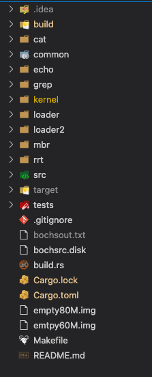
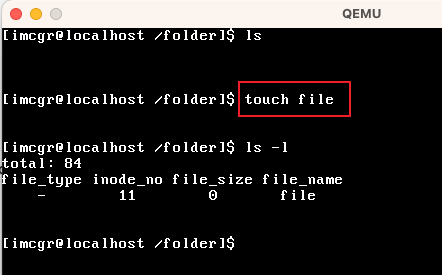
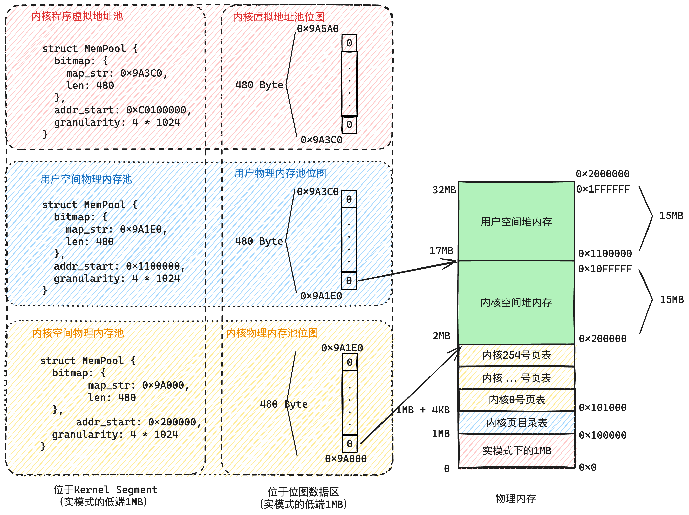
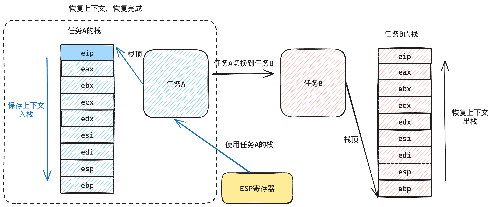
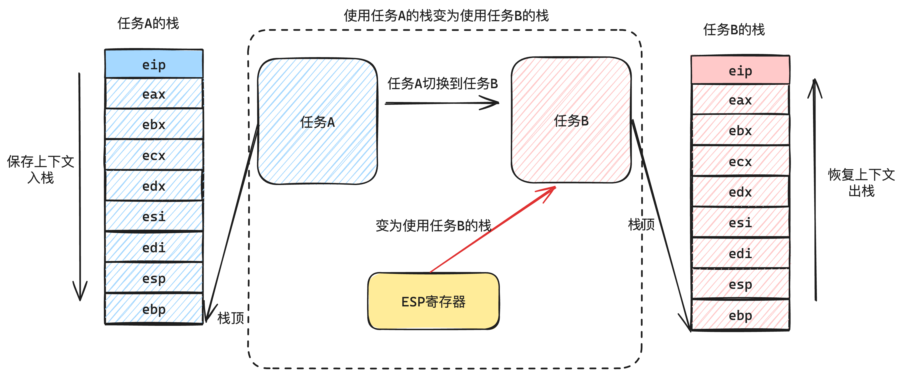
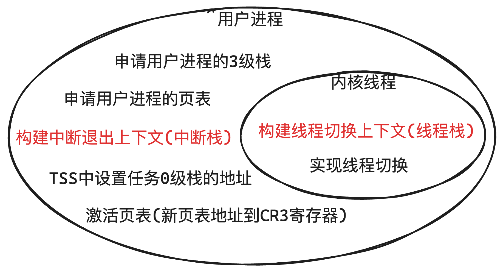

# 一、系统简介

[toc]


本操作系统是一个**使用rust语言实现**、基于**32位**的**x86CPU**的**分时操作系统**。
<br/>

注：

本项目在我的语雀仓库有完整的讲解，建议移步我的语雀文档看更多细节：

项目目录：https://www.yuque.com/caogaorong/xd90rg

项目简介：https://www.yuque.com/caogaorong/xd90rg/cdf8o1cgsbvc99aa  

（跟本仓库的Readme内容一样，但是格式更好，**强烈建议去语雀看**）


## 1.项目特性

在本项目的实现上，我认为该项目有一下特性：

- **rust语言实现**

  - 市面上很多操作系统项目使用的C语言实现，我这里使用的rust实现，可以保证这个项目的代码由我手写实现。也体现了该项目的独特和新颖。
- **基于x86 CPU**

  - x86是市面上最常见的CPU，基于这种通用大众化的CPU，也能说明本项目用到的知识的通用。
- **拥有OS的基本功能**

  * 本项目在实现操作系统的功能上，算得上是“麻雀虽小，五脏俱全”。基本操作系统的核心功能都实现了：
  * **BIOS启动、Mbr引导、Loader加载内核**
    - 使用BIOS启动，Mbr引导操作系统，手写Loader 进入保护模式、加载段描述符、开启分页
  * **中断管理**
    - 实现各种中断：CPU异常中断、键盘中断、硬盘中断等等常规中断
  * **内存管理**
    - 使用页表管理内存，实现进程的虚拟内存，进程独享4GB内存空间
  * ***线程和进程管理**
    * 实现内核线程和用户进程，其中包括PCB的属性的设计，线程和进程的启动、执行，任务的管理、调度。
  * **系统调用（基于中断）**
    * 在实现用户进程后，用户进程处于3特权级下，想调用内核高级功能就得通过系统调用。本系统实现了系统调用，让用户进程跟内核交互。
  * ***文件系统**
    * 本系统实现了一个最小化并且全面的文件系统，实现了文件、目录的层级结构，支持在文件系统对文件以及目录的 增、删、改、查。对于文件和目录的常规操作都有支持。并且**支持从硬盘加载程序并且执行**。
  * **Shell交互**
    * 本系统提供了Shell作为人跟系统交互的桥梁，在Shell读取命令然后执行。***Shell实现了管道，支持多个进程间通信\***。
- mbr启动、Loader引导
  - 本系统使用比较古老的BIOS启动，手写Mbr启动，并且手动实现Loader对系统进行引导。（mbr和loader均为rust实现）

- 没使用任何第三方crate
  - 在市面上很多rust的系统引用了很多第三方的crate，比如blog_os和rCore os。本系统不使用任何第三方crate，所有功能都使用rust的core手动实现。


## 2.项目结构介绍

如下图是该项目的文件结构：



下面我挑几个重点的模块介绍：

| 模块名称 | 模块类型                                                     | 模块介绍                                                     |
| -------- | ------------------------------------------------------------ | ------------------------------------------------------------ |
| build    | **makefile生成**                                             | make之后生成的文件                                           |
| cat      | **用户程序**（独立程序）<br />（写入到文件系统，然后shell可以**加载成为一个进程**运行） | 自制的cat程序，把文件系统中的文本文件内容输出到控制台        |
| echo     | **用户程序**（独立程序）                                     | 自制echo程序，把echo命令跟着的字符串输出到控制台             |
| grep     | **用户程序**（独立程序）                                     | 自制grep程序，根据输入内容，进行过滤，然后输出到控制台       |
| common   | **操作系统内核 源码**                                        | common包，loader、loader2、kernel都会用到的常用工具          |
| mbr      | **操作系统内核 源码**                                        | mbr启动（16位），该模块就两个功能：<br />- 实现mbr规范，引导BIOS<br />- 加载loader（读取硬盘） |
| loader   | **操作系统内核 源码**                                        | loader启动（16位）：<br />- 加载选择子、打开GDT，进入保护模式 <br />- 加载loader2（读取硬盘） |
| loader2  | **操作系统内核 源码**                                        | loader2启动（32位）：<br />- 由于loader生成的指令是16位的，因此在进入保护模式后，需要再进入到loader2执行<br />- 加载kernel（读取硬盘） |
| kernel   | **操作系统内核 源码**                                        | 进入内核的最终实现，包括中断、内存管理、线程进程管理、文件系统等等操作系统核心，都在这个模块 |
| rrt      | Rust RunTime library                                         | 我自制简单的用户程序运行时库，模仿了crt。为用户程序封装了_start入口和exit的调用。 |
| target   | cargo生成                                                    | rust使用cargo生成的二进制文件。忽略                          |
| tests    | 单元测试                                                     | 在这个项目实现中，我写的简单的单元测试                       |

## 3.项目环境介绍

这里我介绍一下项目的开发环境和运行环境。

开发环境（最终是生成一个32位的基于x86的操作系统二进制文件）：

| 名称                  | 值                       | 版本信息                                                     |
| --------------------- | ------------------------ | ------------------------------------------------------------ |
| 操作系统              | MacOS                    | Ventura 13.0.1                                               |
| CPU                   | Apple M1                 |                                                              |
| 编译器                | rustc                    | rustc 1.82.0-nightly (5aea14073 2024-08-20)<br/>binary: rustc<br/>commit-hash: 5aea14073eee9e403c3bb857490cd6aa4a395531<br/>commit-date: 2024-08-20<br/>host: aarch64-apple-darwin<br/>release: 1.82.0-nightly<br/>LLVM version: 19.1.0 |
| 包管理工具            | cargo                    | cargo 1.82.0-nightly (ba8b39413 2024-08-16)<br/>release: 1.82.0-nightly<br/>commit-hash: ba8b39413c74d08494f94a7542fe79aa636e1661<br/>commit-date: 2024-08-16<br/>host: aarch64-apple-darwin<br/>libgit2: 1.8.1 (sys:0.19.0 vendored)<br/>libcurl: 7.84.0 (sys:0.4.74+curl-8.9.0 system ssl:(SecureTransport) LibreSSL/3.3.6)<br/>ssl: OpenSSL 1.1.1w  11 Sep 2023<br/>os: Mac OS 13.0.1 [64-bit] |
| 自动化工具            | make                     | GNU Make 3.81                                                |
| elf文件二进制提取工具 | x86_64-linux-gnu-objcopy | GNU objcopy (GNU Binutils) 2.41                              |
| elf文件dump工具       | x86_64-linux-gnu-objdump | GNU objdump (GNU Binutils) 2.41                              |

运行环境（把这个x86的32位的操作系统镜像运行在虚拟机中）：

| 名称    | 值                 | 环境版本信息                |
| ------- | ------------------ | --------------------------- |
| 虚拟机  | qemu-system-x86_64 | QEMU emulator version 8.2.1 |
| 虚拟机2 | bochs              | Bochs x86 Emulator 2.8      |

> 这里不得不说rust的跨平台开发能力太好了，我在Mac M1上开发，生成一个 x86 的 ELF文件。然后在启动一个qemu虚拟机运行。

## 4.项目运行效果

这里给大家展示一下我的操作系统的基本功能。

下面我从这几个方面来展示：

+ 内置命令
+ 文件系统操作
+ 从文件系统加载进程
+ Shell多进程通信（管道）

### 4.1内置命令

先看内置命令，目前我的系统内置了如下命令（排除文件系统操作和加载可执行文件）：

| 命令名称       | 命令用途           | 命令展示        |
| -------------- | ------------------ | --------------- |
| pwd            | 展示当前工作目录   |  |
| ps             | 查询当前的所有任务 |  |
| clear          | 清屏               |                 |
| ctrl + l快捷键 | 清屏               |                 |
| ctrl + u快捷键 | 删除当前行的输入   |                 |

这是一些基础并且跟功能无关的命令。下面请看我们使用操作系统中，最常用的文件系统相关的命令。

### 4.2文件系统命令

我们使用一个操作系统，最常用的一定是文件系统相关的命令，比如「文件的增、删、改、查」、「目录的增、删、改、查」。我在本系统中基本都实现了，如下表所示：

| 命令名称 | 命令用途                       | 命令展示                                                           |
| -------- | ------------------------------ | ------------------------------------------------------------------ |
| ls       | 展示当前目录下的所有文件。     | <br />> 这里的 `cat`、`grep`是可执行文件        |
| ls -l    | 展示当前目录下的文件细节       | <br />> file_type中，"-"表示普通文件，"d"表示文件夹 |
| cd       | 切换当前工作目录               |                                                     |
| mkdir    | 在当前工作目录下，创建一个目录 |                                                     |
| rmdir    | 删除某个目录名称               |                                                     |
| touch    | 创建一个普通文件               | <br />> 创建了一个名为"file"的普通文件              |

**看到这里可能会问，怎么没有读写文件的命令？**我们一般使用 `cat`命令读取文件，并且我们会使用 `echo hello > hello.txt`来写入文件。

**这个** `cat`**和** `echo`**命令是我写的用户程序，这种程序是属于从硬盘加载后作为进程执行的**。因此这个放到下一节。

### 4.3从文件系统加载进程

上面讲的都是内置的命令，都比较简单而且固定。下面就是要从文件系统加载可执行程序执行了。

在上面讲项目结构中，我提到我实现了3个用户程序，作为小工具：


这三个小工具分别是：

+ `cat`：把一个文件的内容输出到控制台
+ `echo`：把命令后面跟着的字符串输出到屏幕
+ `grep`：使用正泽匹配过滤输入，然后把过滤后的结果输出

本小结，我就展示 `cat`和 `echo`实现读、写一个文件。

| 命令名称            | 展示效果                                                                                              |
| ------------------- | ----------------------------------------------------------------------------------------------------- |
| echo                | <br />> 我这里先创建「hello.txt」文件，然后把"hello"字符串写入到 hello.txt文件中`` |
| cat                 | <br />> 我这里使用 `cat`命令，把hello.txt的文件内容输出                             |
| ">"和">>"输出到文件 | <br />> 这里使用echo 和 ">>" 追加 数据到 hello.txt文件中                              |

这里我简单展示了 `echo`和 `cat`的执行效果。

**这里得注意，**`echo`**和** `cat`**是两个在文件系统的文件**，**`<font style="color:#DF2A3F">`这里体现出来的是 把 可执行文件 从文件系统加载到内存，然后成为一个独立的用户进程执行的过程```</font>``**。

### 4.4 Shell多进程通信（管道）

另外我们在Shell常用的一个功能就是“管道”，这个也是进程间通信的一种方式之一。

本系统设计好管道，可以用于多个进程间通信。比如下面的命令：

```shell
> cat main.rs | grep main
```

> `main.rs`是一个文本文件，我输出到管道，然后经过 `grep`过滤后输出到屏幕

在本系统中，运行效果是这样的：


还可以多级管道，如下图所示：


这里管道的实现主要有一下核心点：

+ 阻塞队列（进程间通信协调）
+ 重定向文件描述符（一切都是文件）

关于更多的细节实现，可以看下面的核心功能介绍。

# 二、*项目核心功能介绍

下面我来带大家过一下整个项目的整体功能，不会太详细（具体详细的内容可以见我写的文档）。

本篇**文章就作为一个目录，带着过一下本系统的核心设计**，当然不够全面，但是可以大概知道本系统实现了哪些功能。

如果想看最全面的讲解可以看我写的 合集文档：

[操作系统](https://www.yuque.com/caogaorong/xd90rg)

## 1. 物理结构

### 1.1 硬盘结构

首先，我们有两块硬盘：

+ hd60M.img
+ hd80M.img

`hd60M.img`是一个60MB大小的硬盘。它的作用是存放操作系统的，这个硬盘没有分区，是一个裸硬盘。

`hd80M.img`是一个80MB大小的硬盘。它的作用是给我们系统存放文件系统的，这个硬盘经过了分区。

先看 `hd60M.img`硬盘的结构，如下图2-1所示：


`hd60M.img`存放了操作系统的核心指令二进制文件：mbr、loader、loader2、kernel。他们占用的扇区大小在图中也标记出来了。

下面我们再看看 `hd80M.img`的结构，我们的 `hd80M.img`是一个有分区结构的硬盘，如下图2-2所示：


> 我们的文件系统，只用其中的一个分区。

### 1.2 模块的结构

再说到本系统的模块结构，**按照他们在硬盘的结构和位置**，我把本系统分为了如下几个核心模块：

+ mbr
+ loader
+ loader2
+ kernel
+ 硬盘中的用户进程（比如我自己写的 `cat`、`grep`等小工具）

这几个模块，在硬盘的结构上，是这样的一种结构，如下图2-3所示：


可以看到我们按照物理结构来划分，把他们所在硬盘的位置，以及如何加载到内存做了描述。

下面我们就从这个系统的设计和逻辑结构上来讲解这个系统。

## 2. 系统整体架构

先看这个系统的整体架构，从全局的视角看一下这个项目的全景，如下图2-1所示：


> 要想一幅图画清楚全部的细节和交互是不可能的，我这里只能挑选出最常用而且容易表现出来的部分，尽量画在一张图里。

本系统把kernel模块的代码从硬盘加载到内存中，放在低端1MB中（实模式可以访问的1MB），如下图2-5所示：


> 为什么放在低端1MB呢？因为低端1MB是开启分页后仍然可以访问的空间（内核页表映射到了）。这里的空间我们可以直接指定内存地址直接访问。
>
> 1MB以上的大部分空间，我们都作为操作系统的堆空间（实现内存管理后，动态申请和释放），是不能任意指定地址直接访问的。

下面我分具体的模块来把最核心的功能介绍一下。

## 3. 系统引导：Mbr、Loader、Loader2

我们的核心在操作系统内核的设计，因此对于加载内核前面的引导部分，我们尽快过一下。

还是看这个硬盘的结构图：


我们可以看到mbr、loader、loader2所在硬盘的位置，最终目的就是把kernel从硬盘中加载到内存。

下面我简单说一说这几个引导程序的作用：

| 模块    | 作用                                                                                                                                                                                                                                                     |
| ------- | -------------------------------------------------------------------------------------------------------------------------------------------------------------------------------------------------------------------------------------------------------- |
| mbr     | 在我看来有两个作用：<br />- 标识当前硬盘或者分区有操作系统。（固定在首个扇区，并且以0x55AA结尾）<br />- 加载loader。把loader从硬盘中加载出来                                                                                                             |
| loader  | 在我的系统设计中，有两个作用：<br />- 进入保护模式，开启32位。<br />- 加载loader2（我特意设计的，因为当前的loader是16位的，在加载中存在一些问题）                                                                                                        |
| loader2 | 这里已经是给加载内核做准备了，核心作用就是「打开分页」以及「加载内核」，具体作用如下：<br />-  构建内核的页目录表（在本系统的设计中，内核的页目录表固定放在0x100000，也就是1MB以上）<br />- 加载页目录表（加载到GDTR寄存器）<br />- 打开分页+ 加载kernel |

引导部分我们不说太详细，在我看来，引导程序最核心的就是要：

+ 进入保护模式、构建页目录表打开分页
+ 加载kernel

其中，分页开启后，最终是构建了一个内核页目录表，如下图3-2所示：


下面就开始介绍我们系统的核心设计。

## 4. 中断管理

我们进入内核后，先要做的就是实现中断处理程序，接收中断。当CPU抛出一些异常（比如General Protection Exception、Page Fault）的时候，我们就可以通过中断处理程序的触发，立马知道有中断发生。

关于中断的设计我不再细说，可以看我本仓库写的文章：

[一、中断介绍](https://www.yuque.com/caogaorong/xd90rg/zrxwvruwpaopvgb8)

[二、中断描述符](https://www.yuque.com/caogaorong/xd90rg/geg3dqaogizgo5h5)

[三、中断发生时的栈操作](https://www.yuque.com/caogaorong/xd90rg/ebmzwvr9wuaf83bd)

这里我们简单讲一下中断发生到执行中断处理程序的原理，如下图4-1所示：


下面我简单介绍一下我的这个系统实现了的中断处理程序：

| 中断处理程序       | 中断类型                                                                                   | 执行的操作                                           |
| ------------------ | ------------------------------------------------------------------------------------------ | ---------------------------------------------------- |
| general protection | CPU异常<br />关于异常可以看这里：[Exceptions - OSDev Wiki](https://wiki.osdev.org/Exceptions) | 通用保护异常。通常是低特权级下访问高级资源           |
| double fault       |                                                                                            | 一般是在中断处理程序里发生异常。所以异常“double”了 |
| page fault         |                                                                                            | 一般是访问一个页表没有映射的内存，所以找不到页       |
| invalid code       |                                                                                            | 指令非法。遇到过，一般是编译有点问题。               |
| 时钟中断           | 硬件中断                                                                                   | 定时触发，中断的频率可以设置                         |
| 键盘中断           |                                                                                            | 键盘按下，生成扫描码                                 |
| 主ATA通道中断      |                                                                                            | 硬盘信号中断                                         |
| 次ATA通道中断      |                                                                                            | 硬盘信号中断                                         |
| 系统调用中断0x80   | 软件中断                                                                                   | 代码指令中使用 `int`指令发起中断                   |

在实现中断处理程序中，中断发生到跳转执行中断处理程序，这个过程是根据中断描述符表来的，我们不用过多关心。

我们的中断处理程序**关键**的就是在于要**清楚如何保存上下文**，其中中断发生**有的上下文是CPU给保存**了的，但是**有的需要自行保存**。这个中断上下文的保存，如果使用rust实现，就简单了很多，因为rust专门有这样的声明：

```rust
extern "x86-interrupt" fn handler(frame: InterruptStackFrame, error_code: u32) {
  
}
```

这里把一个函数使用了 `extern "x86-interrupt"`修饰了，那么这个函数就会自动保存中断的上下文。

但是对于系统调用，必须要清楚栈中的晚上的上下文数据，因此就不能使用这个 `extern "x86-interrupt"`来保存了，而是只能手动保存上下文。这个等待后面系统调用再说。

但是这里我们要清除，当中断发生时，CPU自动保存了哪些上下文，可以看这篇文章：

[三、中断发生时的栈操作](https://www.yuque.com/caogaorong/xd90rg/ebmzwvr9wuaf83bd)

另外中断的频率也是可以调整的，我们可以通过操作「可编程中断控制器」来调整中断的频率。这里就不细说了。

## 5. 内存管理

在写应用层程序的时候，经常要用到堆内存。比如C语言中的 `malloc`来动态申请堆内存空间。我们本系统实现的「内存管理」模块，就是要提供一个口子，可以「动态申请」、「动态释放」内存空间。把内存操作的口子收拢，统一管理，这就是内存管理。

[一、内存结构回顾](https://www.yuque.com/caogaorong/xd90rg/neo3ezf13ustsf3a)

[二、数据结构-位图](https://www.yuque.com/caogaorong/xd90rg/id7oiodx80tuw1d2)

[三、位图的设计](https://www.yuque.com/caogaorong/xd90rg/kvy66r3ipxwio3k0)

[四、*管理内存](https://www.yuque.com/caogaorong/xd90rg/nt3whz7oqsdnfb4y)

[五、细粒度管理内存](https://www.yuque.com/caogaorong/xd90rg/bb8wgb8too55kv3r)

### 5.1 内存空间的划分

而在我们在实现这个系统的过程中，更要**完全把控好内存**的使用。首先我们在实现操作系统的时候，操作内存分为两种内存操作：

| 操作内存类型   | 说明                                                                                                                                                                                                                                                                            |
| -------------- | ------------------------------------------------------------------------------------------------------------------------------------------------------------------------------------------------------------------------------------------------------------------------------- |
| 非管控的内存   | 首先内核代码本身加载到内存了，需要一个内存空间存放，这一块空间包括了：<br />-「内存管理模块」的元数据。比如内存管理的位图<br />- 内核的代码指令<br />- 内核页目录表、内核页表所在的空间<br /><br />这部分空间不参与内存管理的动态分配（毕竟这是内存管理的元数据，没法参与管理） |
| 内存管理的内存 | 剩下的就是被内存管理模块管控的内存，提供口子统一在这里申请和释放内存                                                                                                                                                                                                            |

先看我们目前的内存结构，如下图5-1所示：


我们可以看到现在宏观上的内存结构，可以分为这几个部分：

+ 低端1MB
  - 实模式下低端1MB空间，直接指定地址访问空间
+ 内核页目录表、内核页表
  - 固定内存地址访问，毕竟分页功能是要经过这个页表的映射的
+ 剩下可用内存
  - 用作实现「内存管理」的空间

我们先看下低端1MB的结构，如下图5-1所示：


可以看到，我们**把kernel的指令部分，都加载到低端1MB中，**在这低端1MB是不被内存管理管控的，指定内存地址就可以访问（得益于这一块空间的页表映射，因此物理地址跟虚拟地址是一样的）。

我们把内存确定好后，空间的划分就成了这个样子，如下图5-3所示：


### 5.2 内存管理的设计与实现

在上面图中，我们说了哪些内存空间是可以被操作系统用来实现内存管理的，现在我们就要对这部分空间进行统一管理，要求做到 统一动态申请、统一动态释放。

其实这个实现原理也很简单，就是使用位图。**用位图来构建一个内存池，位图的某一位，就代表该池子中某一块内存使用与否**。如下图5-4所示：


而我们实际上可以把要管理的内存，也分为了好几种：

+ 物理内存池
  - 内核物理内存池。内核线程申请内存空间，统一从这个池子里申请。
  - 用户物理内存池。用户进程申请内存空间，从这个池子里申请。
+ 虚拟地址池
  - 每个进程有自己的页表，有自己的虚拟地址范围，因此每个进程需要一个虚拟地址池

在本系统中，这些池子的细节，我们可以看下表：

| 内存池名称                                | 类型       | 代表的地址范围                                   | 位图地址                      |
| ----------------------------------------- | ---------- | ------------------------------------------------ | ----------------------------- |
| 内核物理内存池                            | 物理内存池 | [0x200000, 0x11000000)总15MB 物理内存            | [0x9A000, 0x9A1E0)总480 bytes |
| 用户物理内存池                            | 物理内存池 | [0x11000000, 0x2000000]总15MB 物理内存           | [0x9A1E0, 0x9A3C0)总480 bytes |
| 内核虚拟地址池                            | 虚拟地址池 | [0xC000 0000, 0xC0F0 0000)总15MB，逻辑上虚拟的   | [0x9A3C0, 0x9A5A0)总480 bytes |
| 用户虚拟地址池<br />(每个用户进程都有1个) | 虚拟地址池 | [0x8048000, 0xC000 0000)约总2.88GB，逻辑上虚拟的 | 动态申请的地址总92KB（23页）  |

最终构建的内存池的效果如下图5-5所示：



关于更多内存池的细节，可以看我写的这篇文章：

[四、*管理内存](https://www.yuque.com/caogaorong/xd90rg/nt3whz7oqsdnfb4y)

### 5.3 细粒度的内存管理实现（依赖进程/线程的实现）

上面我们讲了内存管理的底层数据结构就是用的「位图」，**我们位图的1个位，就表示了4KB空间的使用与否**。

这样粒度明显太大了，在上层使用的的时候，并不会这么大的粒度分配，而更多的是按照字节分配。

因此把申请到的1页空间，封装成一个Arena的结构，然后“切碎”成很多小的MemBlock，然后把没用完的MemBlock串起来，放到申请内存的这个任务中。如下图5-6所示：


然后把这些小块MemBlock组成链表，串起来，如下图5-7所示：


最后把这些剩下的MemBlock按照规格的划分，放到“申请内存的这个任务”的PCB里，下次申请就直接从这个MemBlock队列里面取，如下图5-8所示：


这样下次该任务再申请内存空间的时候，会先从自身任务拥有的MemBlock列表中去匹配合适规格的MemBlock，直接从这里申请。而不再从内存管理中的位图申请。

## 6. 内核线程

我们把希望计算机做的一件事情，抽象成“任务”，那么每个“任务”都有自己的元信息，这个就是 `TaskStruct`。

我们还希望多个任务可以切换，那么我们只需要**把 `TaskStruct`跟对应的上下文资源绑定，并且在切换任务的时候，保存和恢复上下文资源，就可以做到让一个执行中的程序“暂停”和“继续”的效果**。

在本节中，我们讲一讲内核线程的实现，用户进程我们放到下一讲。细节的可以看我写的这些内容：

[一、如何理解进程/线程](https://www.yuque.com/caogaorong/xd90rg/ov0wdtv30i9bub8g)

[二、任务切换的原理](https://www.yuque.com/caogaorong/xd90rg/nuis76oryudge1ra)

[三、任务队列](https://www.yuque.com/caogaorong/xd90rg/hn1megp1fl6mmb3h)

[四、创建内核线程](https://www.yuque.com/caogaorong/xd90rg/nihyeq94xvrtmdg3)

[五、线程切换](https://www.yuque.com/caogaorong/xd90rg/qiihcw0plftfcdsg)

**当我们理解了程序的执行原理，以及用到的资源（栈空间、寄存器资源）**，那么我们也能理解，只要把这些资源保存起来，然后切换任务，就可以做到“暂停”这个任务，然后还可以恢复执行。

而我们线程切换，就是保存上下文资源和恢复上下文资源的过程，目前一个程序，我们用到的就是寄存器资源（栈地址也是寄存器中），因此，只要我们把寄存器资源保存到一块内存空间就好了，我们把它保存到栈中。

比如我们要从任务A切换到任务B，那么我们先保存任务A的寄存器资源，如下图6-1所示：



保存完毕后，我们**把当前使用的栈（ESP寄存器）切换到任务B的栈地址（记录在任务B的TaskStruct中）**，如下图6-2所示：



然后再恢复任务B栈内的寄存器资源，如下图6-3所示：


这样以往，我们就实现了保存和恢复某个任务的上下文资源。

但是在一个**`<font style="color:#DF2A3F;">`线程首次执行 `</font>`**的时候，则需要** `<font style="color:#DF2A3F;">`自己构建这个线程的上下文资源 `</font>`**，然后让**esp指向这个构建好数据栈空间**，然后走「**恢复上下文**」的逻辑，从而做到切换的效果。

这个就稍微复杂一点，可以看我写的这篇文章：

[四、创建内核线程](https://www.yuque.com/caogaorong/xd90rg/nihyeq94xvrtmdg3)

其实原理也简单，就是利用恢复上下文切换线程的这个原理和流程，我们创建好TaskStruct后，自己填充这个任务的栈数据，然后恢复上下文，从而实现切换任务。

## 7. 用户进程

我们上面实现了内核线程后，下面就要实现用户进程。用户进程的实现比内核线程要复杂一些。

关于用户进程跟内核进程的关系如下图7-1所示：



关于实现用户进程和内核线程，底层逻辑核心的区别有以下几点：

|                    | 内核线程                                                                                         | 用户进程                                                                                    |
| ------------------ | ------------------------------------------------------------------------------------------------ | ------------------------------------------------------------------------------------------- |
| 运行时所处的特权级 | 0级                                                                                              | 3级（中断处理程序时是0级）                                                                  |
| 任务PCB            | 申请1页（内核空间）                                                                              | 申请1页（内核空间）                                                                         |
| 虚拟地址池         | 所有内核线程**共用**一个虚拟地址池<br />总可用虚拟地址的范围是：[0xC001 0000, 0xFFFF FFFF] | 每个进程有**各自**的虚拟地址池<br />每个地址池的地址范围是：[0x804 8000, 0xC000 0000) |
| 页表               | 所有内核线程**共用**一个页**目录**表                                                 | 每个用户进程有**各自**的页**目录**表                                            |
| 栈空间分布         | 只有0级栈(跟PCB共用1页)                                                                          | - 0级栈(PCB共用1页)<br />- 3级栈(单独申请1页**用户空间**作为3级栈)                    |
| 栈空间的使用       | 中断和非中断都使用1个栈，被执行时需要把0级栈地址放到TSS                                          | 非中断执行时使用3级栈<br />中断发生时使用0级栈                                              |

以上对比了内核线程和用户进程在实现上的异同，对比项可以分为两大类：

+ 用到的资源的不同
+ CPU特权级的不同

**资源上的差异还好说，申请资源就是了，关键在于CPU特权级，我们如何让用户进程运行在3特权级下。**

关于用户进程，我也不细讲了，详细的细节可以看我写的这几篇文章：

[一、用户进程](https://www.yuque.com/caogaorong/xd90rg/ccixsgggxf9gdkt0)

[二、*任务切换的栈操作](https://www.yuque.com/caogaorong/xd90rg/gid8evgvrez089z1)

[三、实现用户进程的常见问题](https://www.yuque.com/caogaorong/xd90rg/gp0xepn330qvzs3a)

[四、进程拥有的资源](https://www.yuque.com/caogaorong/xd90rg/ggw8nwpxnupx5090)

要理解用户进程的难点，我认为要抓住用户进程的要点，这个要点就是「**特权级**」。

> 我们设计出用户进程，就是限制这个任务在操作上的安全性，因此特权级就是实现用户进程最大的要点。

### 7.1 中断和特权级

我们系统启动，特权级处于0级下，处于最高级。

我们前面在讲中断的时候，就说到中断发生的时候，CPU会保存上下文，提升特权级，然后中断退出，就会恢复上下文，降低特权级。我们要实现用户进程在低特权级下运行，就要利用**中断的退出**。

因此，要想利用好中断退出，我们必须理解中断发生和结束时，栈内数据的完整变化，这个可以看我签名讲过的文章：

[三、中断发生时的栈操作](https://www.yuque.com/caogaorong/xd90rg/ebmzwvr9wuaf83bd)

当CPU发生中断，会保存寄存器上下文，那么栈中的数据就是这样的，如下图7-2所示：


当中断恢复的时候，CPU也会自动从栈中的这个数据来恢复寄存器的值。**`<font style="color:#DF2A3F;">`其中就包括了eip的值，也就是当上下文恢复eip的值，就会实现跳转 `</font>`**。

所以我们要利用好栈内上下文数据，恢复时的跳转属性，来达到跳转执行用户程序的目的。

我们创建好一个用户进程的TaskStruct，通过填充栈信息，如下图7-3所示：


其中我们把栈的数据逻辑划分为了两个栈：

+ 中断栈
  - **CPU发生中断时自动压栈和出栈**。我们通过填充这个栈的数据，然后中断退出，从而达到跳转的目的。
+ 线程栈
  - 这是为了兼容中断处理程序发生后，手动压栈的数据。
  - **内核线程切换和启动的时候，就是利用的这个栈的数据，因此我们用户进程也要兼容。**

### 7.2 用户进程的启动和切换

当我们构建好用户进程 `TaskStruct`的栈数据（中断栈和线程栈）之后，我们就可以来通过“恢复上下文”的方式来跳转，并且利用 `iret`中断退出的指令，来实现特权级降低和指令跳转功能。

这个过程如下图7-4所示：


随着栈内上下文数据的弹出：

+ 先弹出「线程栈」，恢复了一些通用寄存器的上下文，这些是中断处理程序会保存和恢复的上下文数据。
+ 然后利用 `iret`指令，CPU自动弹出「中断栈」，恢复EIP寄存器的值后跳转，以及降低特权级到3级

当我们能够在低特权级下执行某个任务，那么也就是实现了用户进程了。

## 8. 系统调用

[一、什么是系统调用](https://www.yuque.com/caogaorong/xd90rg/hx8dqeoufn84caxp)

[二、如何实现系统调用](https://www.yuque.com/caogaorong/xd90rg/dwr0r165ox50f3ed)

[三、*系统调用的全链路分析](https://www.yuque.com/caogaorong/xd90rg/ir9ltve5u8erw3v7)

我们在低特权级下想要访问高特权级的资源（比如执行某些特权指令），那么就必须使用系统调用（提升了特权级）。如下图8-1所示：


关于系统调用的实现，我这里使用了中断来实现。具体系统调用的细节就不细说了（发现本篇文章我写的内容太多了）。

建议看我写的这篇精华文章，很细节：

[三、*系统调用的全链路分析](https://www.yuque.com/caogaorong/xd90rg/ir9ltve5u8erw3v7)

## 9. 文件系统

一个操作系统最直观的入口，其实就是文件系统，比如我们登录Linux一定要操作文件，比如使用 `ls`、`cd`等命令都是文件系统的命令。

但是其实文件系统是跟操作系统耦合性最小的，**在我看来，操作系统更偏向底层， 而文件系统其实偏向设计**：

+ 比如上面讲的操作系统很多概念比如全局描述符表、页表、中断等等，都跟硬件强相关。
+ 而文件系统硬件相关的只有读写硬盘，并且这个完全可以封装成一个驱动层。剩下的就全是“文件”的设计，比如“文件如何存储”、“文件和目录的关系”、“文件如何CRUD”等等。更加偏向应用层的设计

[一、硬盘和分区结构](https://www.yuque.com/caogaorong/xd90rg/kawnfrv5978qavfl)

[二、硬盘的操作(PIO模式)](https://www.yuque.com/caogaorong/xd90rg/fbl3o376a72sad9a)

[三、什么是文件系统](https://www.yuque.com/caogaorong/xd90rg/nx2scwyqtc63i9bp)

[四、*文件系统的概要设计(精华)](https://www.yuque.com/caogaorong/xd90rg/hm2zrhix44u9uy5i)

[五、文件系统的需求](https://www.yuque.com/caogaorong/xd90rg/tovg17d0yrtl1ms8)

[六、inode的详细设计](https://www.yuque.com/caogaorong/xd90rg/au39b2bwez5axn70)

[七、目录项的设计](https://www.yuque.com/caogaorong/xd90rg/ifon9q8nx4ha4od8)

[八、文件的打开结构(文件描述符)](https://www.yuque.com/caogaorong/xd90rg/vzqn5hcotclowvbq)

### 9.1 分区结构

在理解文件系统之前，我们要先能够操作硬盘。那么我们就得理解分区。

分区就像给硬盘格式化，让硬盘有一个基本的格式信息。“分区”这种结构是市面上大家都遵守一种结构。这里分区的结构也不细说了，可以见如下图9-1所示：


更多的可以看这里：

[一、硬盘和分区结构](https://www.yuque.com/caogaorong/xd90rg/kawnfrv5978qavfl)

### 9.2 硬盘操作：PIO模式

在大学中我们学计算机组成原理，都学过主机I/O的数据交换方式有三种：

+ 程序查询
+ 程序中断
+ DMA

我们的系统要读取硬盘，那么也就是这三种方式。在前面的MBR、Loader中，读取硬盘使用的是程序查询，也就是读取硬盘的寄存器，如果数据没有准备好就轮询等待。

而现在我们的文件系统实现中，我们有了中断的功能，我们使用 程序中断的方式。这个其实就是 硬盘的PIO模式。

关于PIO模式的使用方法，可以看这篇文档：

[ATA PIO Mode - OSDev Wiki](https://wiki.osdev.org/ATA_PIO_Mode)

这里就不细说了。

### 9.3 文件系统的核心设计

文件系统有点像内存管理 + 文件管理。在我看来文件系统有两个东西要管理：

+ 管理硬盘的块（或者说扇区，使用LBA地址访问）
+ 管理“文件”（这是一种抽象的概念）

对于“块”或者“扇区”的管理，我们可以跟内存管理一样使用「块位图」。

而对于“文件”的管理，我们就要引入新的数据结构和设计了。

另外我们的文件系统是要持久化保存的，所以跟其他的结构设计还不一样（只在内存里存在就行），我们文件系统设计的数据结构得保存到硬盘里。

这里我不多说了，直接放出文件系统设计后的结构，如下图9-2所示：


更加详细的讲解可以看这里：

[四、*文件系统的概要设计(精华)](https://www.yuque.com/caogaorong/xd90rg/hm2zrhix44u9uy5i)

### 9.4 文件系统的目标

文件系统是一个复杂的系统，在实现这个过程中，我们一定要明确我们要实现哪些功能，这样有目标地去做，才能高效地实现。

因此我找了一些作为一个 常规文件系统有的功能，然后列出要实现的需求：

[五、文件系统的需求](https://www.yuque.com/caogaorong/xd90rg/tovg17d0yrtl1ms8)

这样我们更加有目的性地去思考和设计。在我看来，我们的目标最核心的无非一下几点：

+ 文件操作：实现文件的增、删、改、查
+ 目录操作：实现目录的增、删、改、查
+ **目录和文件的层级关系**

其中，最需要考虑和设计的就是「目录和文件的层级关系」。要想实现得优雅、扩展性高，是我们文件系统的亮点。

### 9.5 inode的设计

在理解文件系统的设计中，只要在我看来，需要理解三个核心模块：

+ inode
+ 目录项
+ 文件和目录

**一个文件必然要包含数据**，不然这个文件毫无意义。

其中**inode描述的是一个文件的数据的元信息**，比如某个文件包含的数据，分布在哪些地方。

因此，inode结构中最核心功能就是 表明这个文件的数据内容 在哪些扇区，也就是如下图9-3所示：


这里inode的数据扇区 `i_sectors`是一个数组，长度是有限的，要是文件的长度超过这个怎么办呢？因此我们有了二级索引，如下图9-4所示：


我们通过设置i_secotors的最后一项的值指向的是间接块的LBA地址，然后该块的全部数据又指向新的LBA块。

这样间接块的设计，那么一个inode就可以包含多个数据块了（如果不够甚至可以再增加一级间接块）。关于inode的设计，详细的可以看我写的这篇文章：

[六、inode的详细设计](https://www.yuque.com/caogaorong/xd90rg/au39b2bwez5axn70)

### 9.6 文件、目录和目录项的设计

在实现文件系统中，目录和文件是存在层级关系的，但是目录和文件这两种类型，我们都抽象理解为“文件”。

在设计上，我们不区分「目录」跟「普通文件」，他们都有自己的inode指向对应的数据区。那么怎么区分一个文件到底是「目录」还是「普通文件」呢？我们使用「目录项」的结构。

目录项记录一个“文件”的名称、类型、inode号。而根据inode号就可以找到inode，就可以找到当前“文件”包含的数据区。

+ 这里的“文件”可以是普通文件，也可以是目录
+ inode的数据区，如果是普通文件，那么数据区里面是这个文件的二进制数据。如果是目录文件，那么这个inode的数据区是很多的目录项。

因此有了目录项、inode、目录、普通文件的设计，他们现在的关系如下图9-5所示：


关于更多他们关系的讲解，可以看我写的这篇文章：

[七、目录项的设计](https://www.yuque.com/caogaorong/xd90rg/ifon9q8nx4ha4od8)

[为什么inode和目录项要分开存储？](https://www.yuque.com/caogaorong/xd90rg/hl1c0ppymd040krh)

### 9.7 文件描述符

每个进程都可以打开一个文件，并且可以重复打开文件。并且打开之后，**同一个文件的两个打开结构，互不干扰**。比如vscode浏览器到这个文件的第100字节，而edge浏览到这个文件的第300字节。两者互相独立。

那么关于打开一个文件，我们可以得出以下结论：

+ 同一个文件可以被打开多次
+ **同一文件打开多次后，可以处于不同的偏移量**
+ 打开后，可以进行的操作，比如读、写权限

因此，我们打开一个文件后，应该需要一个结构来描述这个文件的“打开结构”，相对于inode和目录项的结构，这是一种动态结构（同一个文件，但是偏移量不同）。

因此，我们可以把这些 「打开的文件结构」统一放到一起，组成一个「文件结构表」，如下图9-6所示：


我们可以看到：

+ `OpenedInode`**是描述的一个文件的静态属性**，比如文件所在的地方、文件数据的内容
+ `File`**（文件结构）描述的是文件的动态属性**，其中 `file_off`描述了这个文件操作的偏移量
+ 如果**多次打开一个文件**，那么 `OpenedInode`**是同一个**，但是会有**不同的** `File`**文件结构**。（因为不同的打开偏移量不同）

上面的「文件结构表」是整个系统全局的，而我们**每个进程**应该拥有自己**独立的操作的文件**，因此我们抽象出「文件描述符」的结构：

+ 每个任务的 `TaskStruct`有个「文件描述符数组」，这个数组的值就是「文件结构表」的下标。
+ 每个进程的「文件描述符」就是「文件描述符数组」的下标。

也就是「文件描述符」定位到「文件描述符数组」的元素，再定位到「文件结构表」中的文件结构，然后再定位到「具体的文件（包括偏移、inode）」，这个过程如下图9-7所示：


当我们完成文件的设计，特别是目录项、目录、文件的层级关系的设计，以及inode的理念，我们就基本上已经完成了我们最终的文件系统了。

剩下的操作比如「对文件增、删、改、查」和「对目录的增、删、改、查」都只要按照这个设计来，填充数据和查询数据就好了。

## 10. 系统交互

最后一步就是实现系统交互的，我们的系统基本上实现得大差不差了，我们Shell的作用只是锦上添花。关于系统交互上，详细设计可以看下面我写的文章：

[一、fork系统调用的实现](https://www.yuque.com/caogaorong/xd90rg/pz0qeye9em2wv6z6)

[二、Shell的基础实现](https://www.yuque.com/caogaorong/xd90rg/yz4avi14cw3gnobl)

[三、实现从文件系统加载并且运行程序](https://www.yuque.com/caogaorong/xd90rg/rgat9hrzf04d9pcx)

[四、运行用户程序支持参数](https://www.yuque.com/caogaorong/xd90rg/pkasrrnhz7lrkgse)

[五、*Shell支持管道](https://www.yuque.com/caogaorong/xd90rg/ytps9goek3td5dkf)

[五、系统调用exit和wait](https://www.yuque.com/caogaorong/xd90rg/hya7224s715pm6vq)

我们在这一步实现中，基本上把前面所学的都利用起来了，在我看来，本系统的系统交互，有一下几个核心点：

+ 实现fork创建进程
  - 这也是多进程的开始，也是系统之间交互的基础支撑
+ 从文件中加载用户程序
  - 真正实现用户进程。把用户进程的二进制指令，从硬盘中加载到内存，然后跳转执行。乍一看很复杂，其实理解了程序的原理后，就很简单了。
+ 管道和文件描述符的重定向
  - 实现我们最常见的命令，并且实现进程间通信

### 10.1 fork进程

实现进程的fork功能，几乎是后面实现多进程以及管道的前提。也是理解我们在应用层编码中多线程的重要一环。

我在这里简单说一说fork的实现，具体的可以看我写的这篇文章：

[一、fork系统调用的实现](https://www.yuque.com/caogaorong/xd90rg/pz0qeye9em2wv6z6)

**所谓fork，其实就是把当前进程拥有的资源全部拷贝一遍（**`<font style="color:#DF2A3F;">`深拷贝 `</font>`**）**，那么一个进程拥有哪些资源呢？我们可以看如下图10-1所示：


剩下的就是要拷贝进程拥有的资源了，比如「TaskStruct」、「中断栈」、「文件描述符表」这些都好说，关键复杂的在于「拷贝一个进程的堆内存空间」。

因为拷贝进程的堆内存空间，也就意味着要完整**`<font style="color:#DF2A3F;">`拷贝的页表映射关系 `</font>`**。

比如进程A fork出了进程B，进程A的资源X复制了一份得到资源X'。那么fork后，进程A通过地址0x1234到资源X，那么进程B也要通过地址0x1234访问到资源X'。

也就是效果是如下图10-2所示的：


根据上图10-2，我们把进程的堆内存指向的某个物理空间进行了数据拷贝，但是使用虚拟地址访问的时候，虚拟地址要相同。

要实现这个效果，我们就处理起来比较麻烦了，这个拷贝流程如下图10-3所示：


关于fork这个过程其实并不简单，建议还是看看我写的文章：

[一、fork系统调用的实现](https://www.yuque.com/caogaorong/xd90rg/pz0qeye9em2wv6z6)

### 10.2 从文件系统加载程序运行

在上面进程管理中，我们可以实现把一个内核函数，封装成一个用户进程。

现在我们希望把一个程序从硬盘加载到内存，然后再作为用户进程执行。**其实这个原理是一样的，不管程序是来自哪里，都是跳转到入口开始执行**。

因此关键点在于，**我们把一个程序的指令加载到内存，然后根据程序的入口地址封装成一个用户进程**即可。

在常规操作系统的实现中，由于这个用户程序是其他操作系统生成的（比如在Linux），因此我们需要解析ELF文件，然后提取出 二进制指令部分，然后加载到内存的某个地址。

这里我使用了一个比较取巧的方式，直接使用x86下32位的Linux的objcopy工具，直接把一个32位的elf文件中的指令二进制给提取出来了，然后再写入到我们自己操作系统的文件系统里，这个过程如下图10-4所示：


当我们的操作系统能够把用户程序的二进制加载到内存，并且知道这个程序在内存的入口地址之后，就可以根据这个封装成一个用户进程了，这个过程如下图10-5所示：


这个加载用户进程并且执行的过程，**其实本质上跟前面进程管理，把一个函数封装成用户进程 没有区别**，因为我们**`<font style="color:#DF2A3F;">`只需要知道一个程序的在内存的入口地址 `</font>`**，就可以实现**跳转执行指令**了。

关于这个过程的更多细节，可以看我写的这篇文章：

[三、实现从文件系统加载并且运行程序](https://www.yuque.com/caogaorong/xd90rg/rgat9hrzf04d9pcx)

### 10.3 Shell支持管道

在使用操作系统时，我们经常使用到管道，并且管道是一个很好的进程间通信的方式。

**因此本系统中也要支持管道，并且要优雅的地支持管道功能**。

在本系统中，管道使用一个「阻塞队列」来实现，阻塞队列如下图10-6所示：


本系统中支持管道的实现，并且**管道也使用文件描述符来访问**，也就是现在文件描述符和管道的关系是这样的，如下图10-7所示：


也就是文件描述符有了类型，既可以访问文件，也可以访问管道，还可以访问标准输入和标准输出。

> 后面就知道这种设计的好处了。一切皆是文件。

然后当我们的父进程创建管道，然后再fork出子进程，子进程就自动复制了父进程的文件描述符，那么子进程就也可以访问到管道了。这个结构如下图10-8所示：


那么只要两个进程可以访问到同一个管道，那么这两个进程就可以通过管道来信息交互的，一个进程往管道里写数据，一个进程往管道里消费数据，并且这个管道是一个**阻塞队列**，可以**保证生产者和消费者协调进行**。

另外再搭配上 文件描述符的重定向，就可以实现我们很常用的的命令：

```rust
cat xxx.log | grep 2024 | grep main >> main.txt
```

这个命令的实现思路是这样的，如下图10-9所示：


而在实际的原理中，我们做的其实是两件事情：

+ 父进程创建管道，多个子进程共享管道。
  - 这样看来一个管道就是一个生产者消费者模型，从而实现数据交换的目的
+ 重定向文件描述符。
  - 在不改动子进程指令本身的情况下，修改进程的文件描述符
  - 把进程的标准输入、标准输出文件描述符，修改为管道或者文件的文件描述，那么这个进程原本的标准输入和输出，就变成了对管道或者文件的操作

当我们把这两件事做好后，实现的效果就是如下图10-10所示：


其实关于管道的实现和思考还有很多细节，具体的可以看我这篇文章：

[五、*Shell支持管道](https://www.yuque.com/caogaorong/xd90rg/ytps9goek3td5dkf)

### 10.4 系统调用wait和exit

一个进程调用exit会退出，这个进程的资源会被销毁。

父进程调用wait会等待子进程，送子进程的“最后一程”。

这个过程有点像是fork的逆操作，把fork中用到梳理的资源，都给释放掉（包括内存资源、文件资源、管道等等）。这里就不细讲了，可以看我写的这篇文章：

[五、系统调用exit和wait](https://www.yuque.com/caogaorong/xd90rg/hya7224s715pm6vq)

## 11. 其他

其实还有很多东西没有讲，我认为不是特别核心的设计，就算了。

+ 标准输出
  - 如何实现在屏幕上打印字符，我们在文本模式下，往显存的区域按照规则写入ascii码即可。还有根据显卡控制器的规则，控制光标。
+ 标准输入（如何读取键盘输入的键）
  - 这个涉及到键盘的扫描码，读取键盘中断中的扫描码，然后再根据键的组合（通码、断码、shift键），来生成对应的ascii码。本系统中把ascii码存到了一个全局的阻塞队列中。
  - 然后标准输入的话会从阻塞队列中读取数据，如果没有数据就会阻塞。

还有很多其实我觉得特别有意思，但是不是本系统的核心设计，并且限于篇幅没有写的。

## 12. 参考资料

《操作系统真象还原》

[https://os.phil-opp.com/](https://os.phil-opp.com/)

[https://docs.rust-embedded.org/embedonomicon/preface.html](https://docs.rust-embedded.org/embedonomicon/preface.html)

# 四、展望

## 1. 我为什么要实现这个操作系统

**这个项目从我第一次提交到最后的结束，几乎耗时我5个月，满打满算的5个月**。这5个月来，我几乎把所有的空余时间都花在了这个上面。每天除了上班，就是在写这个项目。

首先本系统是我三年前写的一个操作系统的延续：

[GitHub - CaoGaorong/MyOS: To make an operating system from scratch](https://github.com/CaoGaorong/MyOS)

三年前我还在大学的时候，就开始想着写一个操作系统了，当时我是跟着书《操作系统真象还原》写的（使用的C语言），当时是大三，我也是几乎把所有空余时间都花在了这个上面。

但是由于时间不够充裕，只有一个学期的时间，之后就要找工作了。所以只是跟着书上写，并且并没有完全写完（项目能跑，但是文件系统没有实现）。

在我上面三年前的仓库的readme中，最后一段我曾经说要继续写操作系统，并且补上文件系统，而且当时我就曾想过要用rust来实现。**没想到时隔三年的今天，我都实现了，完善了文件系统 + rust实现**。

今年我使用rust把这个操作系统重写、重新设计，我是有三个期望：

+ 重新捡起我学过的操作系统（毕竟三年了，有点忘了）
+ 更加深入完整学习操作系统（之前只是跟着书上看，并没有太多的调试经验，并且没有实现文件系统）
+ 学习Rust语言，找个项目上手（虽然学得不多，但是确实对Rust更加了解了）

现在过了5个月，我把这个项目实现后，再回头看，还是很有成就感了。

## 2. 在这个过程中，我遇到哪些问题

在五个月前，我刚开始有用rust重写这个系统的想法的时候，我是很犹豫的，我最担心的就是这个项目流产，因为当时的我对操作系统是半吊子，rust更是只懂基础语法，很多的偏门用法（比如各种配置）都不会。

所以当时我是很怕这个项目做不完，特别怕这个项目做一半，然后卡住了，后面一直解决不了从而放弃。

**一开始我害怕中途卡住而流产，但是随着后面我遇到问题，解决问题，我渐渐地变得很有自信，我开始越来越坚定地相信我可以完成**。也许是我不断遇到难题并且不断解决的这个过程让我变得信心十足。

除了解决了信念不坚定的问题，更多遇到的就是实打实操作系统和Rust相关的问题。非常多稀奇古怪的问题，特别是操作系统这种底层软件（没有应用层开发时的操作系统兜底），也很容易出现一些少见、并且难以解决的问题。

并且这些问题在市面上很难找到答案，比如**操作系统相关的信息在网上就很少有资源，再配合上Rust又是一个比较新的语言，因此这两者在市面上都很少有相关的资料**。

不过这些问题我最终还是都解决了，我基本从以下三个方面解决了我的问题：

+ 外网的资料
  - 不管是操作系统，还是Rust，外网的资料还是比较多的，有很多的资料可以借鉴
+ 其他相似的项目
  - 自制操作系统的项目有很多，可以参考设计。不过用Rust实现而且功能全的很少。
+ ChatGPT
  - 这两年出了ChatGPT确实让我的编程变得方便了很多，不管是遇到Rust还是操作系统的问题，我都可以问ChatGPT，虽然答案不一定可靠，但是还是给了我很多帮助。

其中我遇到的更细节的问题，更是有不少，有一些我记录了下来：

[记录一次实现fork栈溢出导致的问题](https://www.yuque.com/caogaorong/gxhc23/bfild31on6293mpz)

[最离奇的问题](https://www.yuque.com/caogaorong/gxhc23/onb3e5ekrff8woii)

[QEMU重复启动](https://www.yuque.com/caogaorong/gxhc23/way18wgwd70ioyhy)

[mbr无法打印问题](https://www.yuque.com/caogaorong/gxhc23/lrq2d2mz72dpzlzg)

[release profile编译优化配置](https://www.yuque.com/caogaorong/gxhc23/eaq3cwdme7ircwm9)

[loader的opt-level设置问题](https://www.yuque.com/caogaorong/gxhc23/thb0c4bn0udhb246)

[loader的lto设置问题](https://www.yuque.com/caogaorong/gxhc23/xveplv3fr5psrgn6)

[加载GDT问题](https://www.yuque.com/caogaorong/gxhc23/ubnd788cqayb6hof)

[构建页表途中卡住问题](https://www.yuque.com/caogaorong/gxhc23/zq5ze40iq11pwxbv)

[突然不能打印了](https://www.yuque.com/caogaorong/gxhc23/movur3g3w8xe142t)

[构建IDT死循环问题](https://www.yuque.com/caogaorong/gxhc23/ens8q27f22zak91g)

[静态变量初始化为0值不对的问题](https://www.yuque.com/caogaorong/gxhc23/hoyysq8qrqulik17)

[函数调用却自动内联](https://www.yuque.com/caogaorong/gxhc23/ffleggolk6dllkqw)

还有更多我遇到的问题没有记录下来，**在这个系统开发的早期，经常遇到问题**，有的是关于Rust语言一些特性的问题，**随着我后面对Rust越来越熟练和了解，在本系统的后续开发问题也变得越来越少**。

## 3. 我后续会做哪些事情

这个项目确实一个大项目，耗费我的时间比较长。但是如果说商用价值，确实不大，假如说我去学习一下Java的应用技术、各种中间件、大数据可能更好找工作工作，能有更大的价值。

但是我做这个项目，确实能给我更大的满足感，就像锻炼完虽然很累但是又很爽的感觉。

昨晚这个项目，我的收获确实非常大，我花费五个月觉得非常值得，最主要的是两点：

+ 学习了Rust。并且学习的是底层原理（比如操作汇编、内存）
+ 学习了操作系统。之前只是看，但是这次我自己实现，对操作系统、计算机底层的感悟更加深刻了

所以其实还有很多我可以做的，包括我所在公司的部门就有IM的业务，我想我如果我想深入学习IM，我可以在我的这个系统上实现一套IP/TCP协议栈，让我的操作系统实现网络的功能，这样应该会对IM的理解更加深入。

另外还有很多可以做的，比如对硬盘的操作，我一直想学习使用一下DMA（总是看到这个词，但是没有底层实现过，终归感觉不是完全了解）。还有比如操作系统的图形界面GUI，这个也比较炫酷。

总的来说，可以做的还有很多，**我希望还能有机会，像这次一样，花费半年的时间来沉浸式地去做一件事情。**
